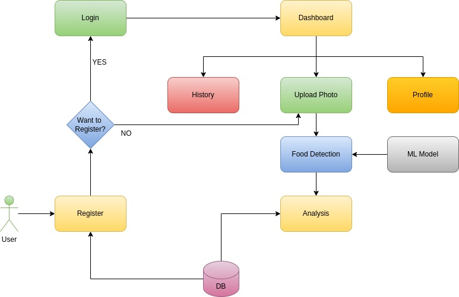
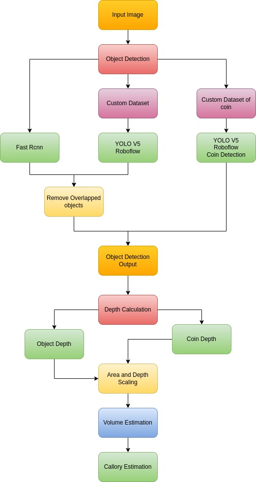

# Weigh my plate

## Overview

Developed a web-based application using the MERN stack that allows users to upload images containing food items. The application employs trained object detection models, including RCNN and YOLOv5, to recognize, classify and measure the calorie count of 22 specific food classes (12 within the custom dataset and 10 in the RCNN dataset).


## How To Execute
``` shell
- Create .env file with 
    - PORT=3080
    - MONGO_URI={{Mongo db url}}
    - JWTENCRYPTIONTOKEN={{Any Secret Key}}
- Add roboflow key in ./server/pythonScript/script_rcnn_custom_depth_coin.py
- conda environment is required to run this project
-Download yolo.weights file
cd server/pythonScript
- put yolov3.weights file here
```

- Open 2 terminals
- Termianl 1
``` shell
cd server
npm install
npm run start
```

- Termianl 2
``` shell
cd client
npm install
npm run dev
- Run showed url in browser
```


## Approach
<p align="center">
  
</p>
<h3 align="center">Flow Chart</h3>

<p align="center">
  
</p>
<h3 align="center">Logic</h3>

- The overall workflow of the project is as shown in the figure above.
    - First the image is uploaded by the user
- Then the image passed through the 3 models
    - Faster R-CNN and the Custom Trained model detect mutually exclusive classes. In case two bounding boxes overlap then the one with the lesser confidence is removed
    - Coin Detection gives the apparent size and the apparent depth of the coin which is placed on a level plane alongside the food plate.
- Using the apparent and the real life dimensions of the coin we can scale the rest of the dimensions of food items to real life values (cm)
- After this, the volume is calculated for each detected object which is then mapped to its appropriate density and calorie values.

## Assumption
- Every image must have a coin
***

